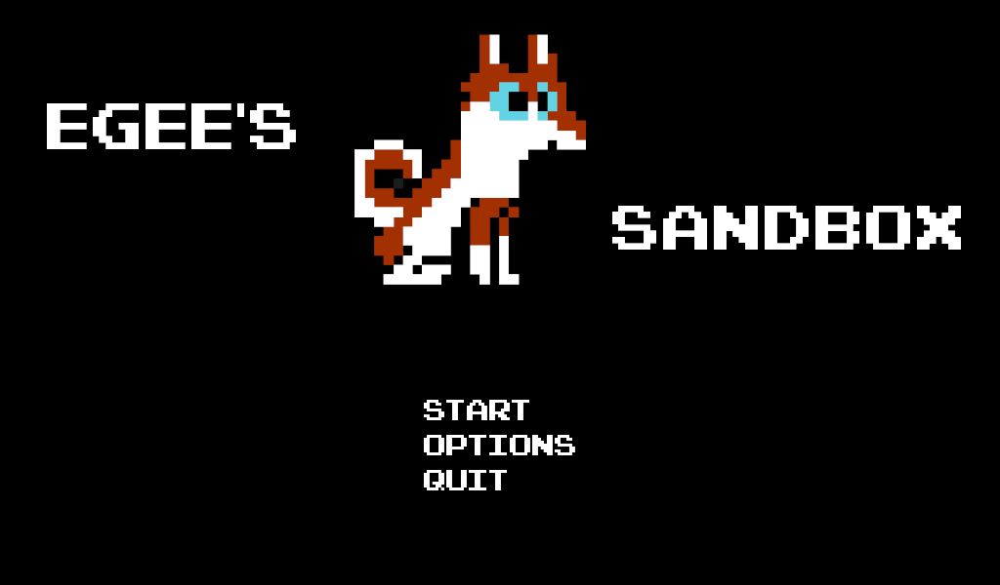

# Egee's Sandbox

Welcome to the Egee Sandbox repository!

In this game you play a small 8-bit Egee sprite and wander around an NES inspired world testing out different game mechanics. The game is currently in Alpha and will reach perpetual beta once the abilities and enemies are implemented.

[Download on Itch.io!](https://egeexyz.itch.io/egees-sandbox)

# Roadmap

  - ~~Release Alpha 🎉~~
  - ~~Title/Pause Screen~~
  - ~~Enemies~~
  - ~~Release Beta 🎉~~
  - Power-Ups
  - Dialog
  - A Proper Ending

Egee's Sandbox is developed with Godot 3.5.2 and GDScript.

# How-To Play

Launch the game from the executable to begin playing.

Move LEFT and RIGHT with the arrow keys.
JUMP with the up arrow key.
